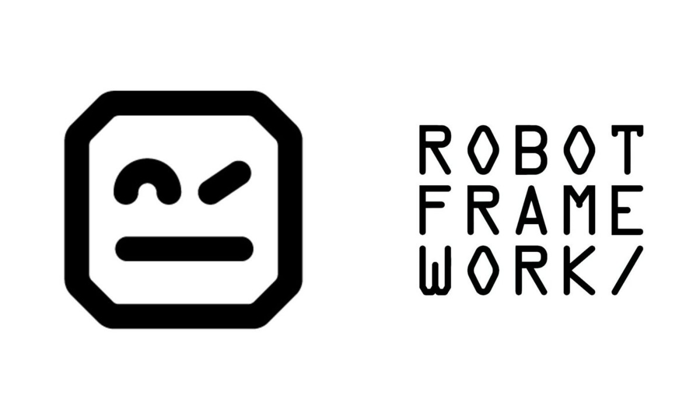
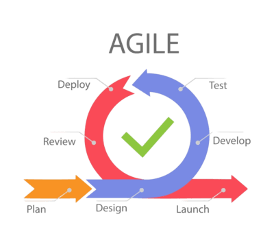
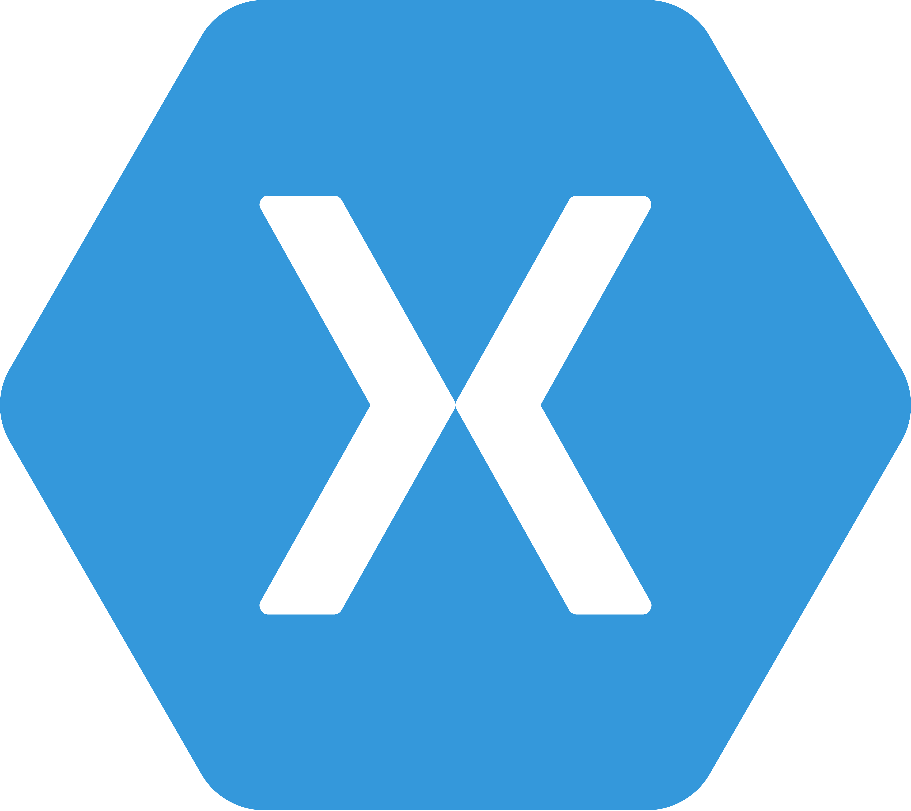
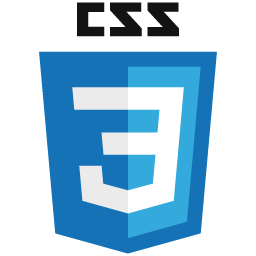
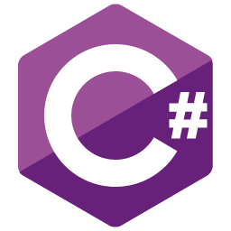

## Hello!!! Here is my Projects for Software Tests and QA for APPs and Microservices 
AI ALGUNS DE MEUS CONHECIMENTOS PARA COMPARTILHAR...

-  https://github.com/carloseduardo1984
-  https://github.com/carlos-eduardo-1984

<h3 align="left">  
  A passionate Senior QA Tester Engineer and here a bit of my knowhow shared !!!   </h3>

- 🔭 I’m currently working on SQA management and AI-Test-Driven by MCP 

<h3 align="left">Let's keep in touch to share and discuss about new studies and hands-Ons, PoCs, and lessons:</h3>

     
 
    
 </a>

 

 
 
<h3 align="left">🔭 Domain Technologies for Software Test Automation:</h3>     

<h4 align="left">🔭 For Software Testing and QA DevOPs:</h4>    

<h4 align="left">🔭 For Software QA:</h4> 

<h4 align="left">🔭 SDLC and QA related knowhow:</h4> 

  

  
 
  
  
              
  

  
  ##
 

